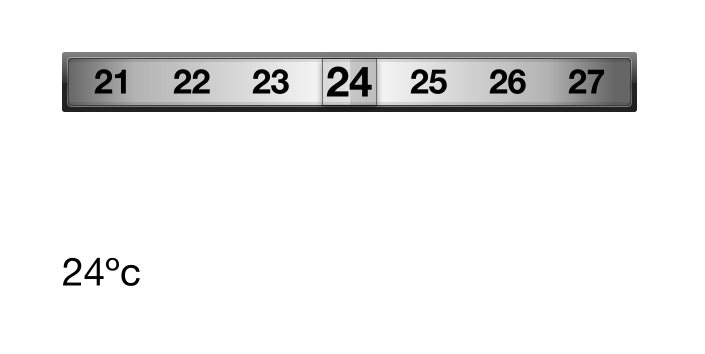

# ScrollSwitcher #

A simple visual number switcher, you can use it for temperature selector of air conditioner.

## NumberSwitcher is the only control ##

Use the NumberSwitcher control just like:

``` objective-c
    NumberSwitcher *zwitcher = [[NumberSwitcher alloc] initWithOrigin:CGPointMake(100, 100) 
                                                        minimumNumber:18 
                                                        maximumNumber:29 
                                                       selectedNumber:23];
    zwitcher.delegate = self;
```
Rendered like:



Enjoy coding!
